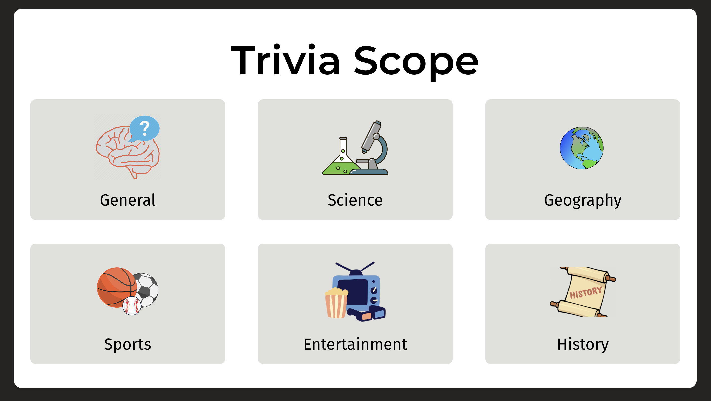
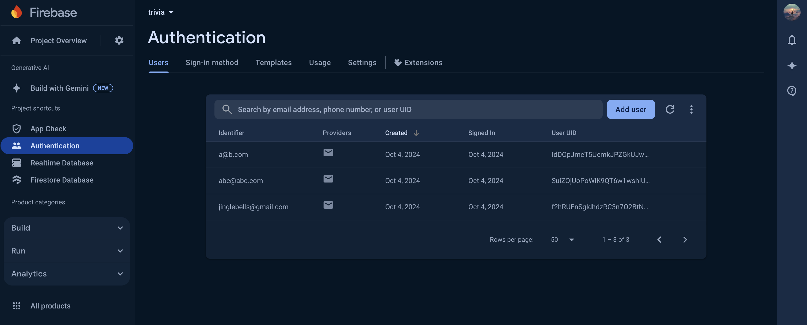

# Trivia Scope 

This is a very simple trivia fullstack application where users can select between trivia categories and answer trivia questions from the category. Users can register themselves with their email adress and password create an account that will save their categorical scores (coming soon!).



## Website Link
[Trivia App](https://trivia-f7176.web.app/)

## Table of Contents
- [Installation](#installation)
- [Technologies Used](#technologies-used)
- [Architecture](#architecture)
- [API Endpoints](#api-endpoints)
- [Future Enhancements](#future-enhancements) (if applicable)

---


## Installation

### Prerequisites
- Node.js (version 14.x or above)
- Firebase CLI (if you plan to deploy the frontend to Firebase)
- Vercel CLI (if you plan to deploy the backend to Vercel)

### Backend (Express API)
1. Clone the repository and navigate to the `trivia-backend` folder:
    ```bash
    git clone https://github.com/your-username/trivia-app.git
    cd trivia-backend
    ```

2. Install dependencies:
    ```bash
    npm install
    ```

4. Run the backend locally:
    ```bash
    npm start
    ```

5. Alternatively, deploy the backend to Vercel:
    ```bash
    vercel --prod
    ```

### Frontend (React App)
1. Navigate to the `trivia` folder (frontend):
    ```bash
    cd trivia
    ```

2. Install dependencies:
    ```bash
    npm install
    ```

3. Run the React app locally:
    ```bash
    npm start
    ```

4. Deploy the frontend to Firebase:
    ```bash
    firebase deploy
    ```

 
---


## Technologies Used
- **Frontend**: React, TypeScript, Firebase 
- **Backend**: Node.js, Express, TypeScript, Vercel
- **Database**: Uses Open Trivia DB for trivia questions and answers
- **Styling**: CSS

  


---


## Architecture

Like mentioine above, the frontend of the application is a React application hosted on Firebase, while the backend is an Express app hosted on Vercel.

### Key Components:
- **Frontend**: A React app that handles user interactions, authentication, and displays trivia questions, and evaluates answers.
- **Backend**: An Express API that fetches trivia questions from the [Open Trivia Database](https://opentdb.com/api_config.php) and sends them to the frontend.
- **Routing**: 
  - `/trivia/:categoryId`: The frontend navigates to this route with the backend to display trivia questions based on the category selected.
  - `/api/trivia/:categoryId`: The backend route to fetch trivia questions for a given category from the Open Trivia API.


 ---


 ## API Endpoints

### `GET /api/trivia/:categoryId`
Fetches medium difficulty trivia questions for the given `categoryId` that align with the categories on Open Trivia DB. If the `categoryId` is `0`, it fetches general questions.


 ---

 
## Future Enhancements  

This app does not use a database at the moment. I do hope to integrate the application with the Firebase Realtime Database so that it can store the highest scores for users based on category and makes the experience more interactive. 


 ---


 

